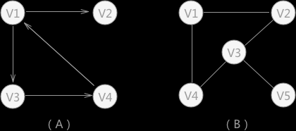
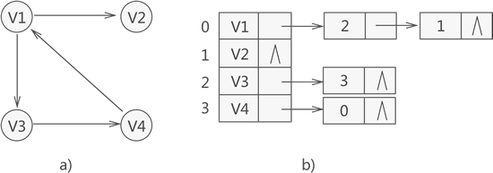
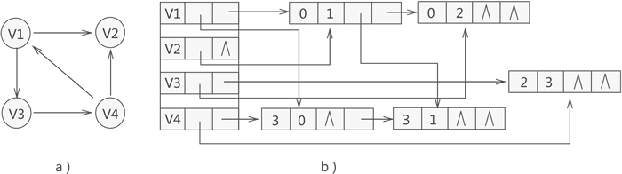
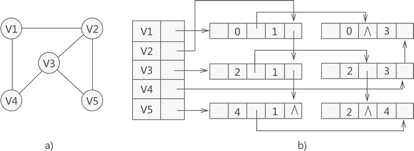

# 图的四种数据结构
## 数组表示法
可以表示有向图和无向图，即是一个二维矩阵。用两个数组分别存储数据元素(顶点)
的信息和数据元素之间的关系(边或孤)的信息。
 
 
以下是有向图和无向图：

 
可以用矩阵1表示A，如下：
 
【待补充】
 
可以用矩阵2表示B，如下：
 
【待补充】
## 邻接表存储图
给图中的各个顶点独自建立一个链表，用节点存储该顶点，用链表中的其他节点存储邻接点
具体如下：
 

## 十字链表法
可以用于存储有向图和无向图，还可以改善邻接表计算图中顶点入度的问题。
实质上就是为每个顶点建立两个链表，分别存储以该顶点为弧头和以该顶点为弧尾的所有顶点。
 
1) 存储顶点的首元节点如下图：
 

- firstin: 用于连接以当前顶点为弧头（箭头指向）的其他顶点构成的链表；
- firstout: 用于连接以当前顶点为弧尾(没有箭头)的其他顶点构成的链表;
2) 存储普通节点的结构如下图：
  
- tailvex: 用于存储以首元节点为弧尾（没有箭头）的顶点位于数组中的位置下标;
- headvex: 用于存储以首元点为弧头（有箭头）的顶点位于数组中的下标;
- hlink: 用于链接下一个存储以首元节点为弧尾顶点的节点;
- tlink: 用于链接下一个存储以首元节点为弧头顶点的节点;
- info: 存储该普通节点的相关信息
 
具体实例如下：
 

# 图的连接多重表
注意：仅适用存储无向图或无向网。
图的邻接多重表可以看作邻接表和十字链表的结合。
 
1) 首元节点结构如下：
     

- data: 存储此顶点的数据
- firstedge: 指向与该顶点有直接关联的存储其他顶点的节点
2) 其他节点结构如下：
  

 
- mark: 标志域，用于标记此节点是否被操作过，例如，在对图进行遍历操作时，为了防止多次操作同一节点，
mark域为0表示还未遍历；mark域为1表示已被遍历过；
- ivex和jvex: 数据域，分别存储图中各边两个顶点所在数组中的位置下标；
- ilink: 指针域，指向下一个存储与ivex有直接关联的顶点的节点；
- jlink: 指针域，指向下一个存储与jvex有直接关联的顶点的节点；
- info:  指针域, 用于存储与该顶点有关的其他信息，如无向图中的权值
3) 具体实例如下：

